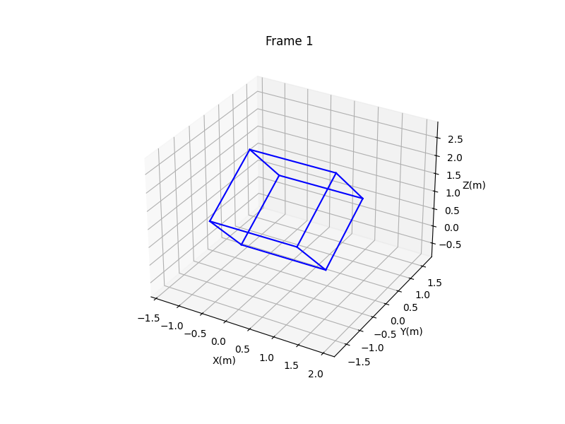

# Cuboid Rotation Estimation from Depth Data

## Project Overview

This project estimates the rotational properties of a 3D cuboidal box using a series of depth images from a ROS 2 bag file. The goal is to process the raw sensor data to determine the box's orientation, visible surface area, and axis of rotation at various timestamps. The implementation handles real-world data challenges such as incorrect units, sensor noise, and background interference.

## Final Visualization

The final output is a 3D animation that visualizes the estimated pose of the cuboid for each frame. The model is oriented and positioned based on the processed depth data, providing a smooth and physically plausible representation of the rotation.



## Key Features

* **ROS 2 Bag Parsing:** Reads and deserializes `sensor_msgs/msg/Image` data from `.db3` (SQLite3) bag files.
* **3D Point Cloud Generation:** Converts 2D depth maps into 3D point clouds using assumed camera intrinsics.
* **Robust Plane Fitting:** Uses the RANSAC algorithm to accurately identify the largest visible face of the cuboid, even with noisy data.
* **Background Filtering:** Isolates the object of interest by filtering the point cloud based on depth, removing background planes.
* **Advanced Rotation Axis Estimation:** Implements a robust Principal Component Analysis (PCA) method on the sequence of face normals to determine a stable axis of rotation.
* **Physical Property Calculation:** Calculates the normal angle, visible area (m²), and average angular velocity (rad/s).
* **3D Animation:** Generates a complete 3D animation of the rotating box and saves it as a GIF.

## Methodology

The algorithm follows a multi-stage pipeline:

1.  **Data Ingestion:** Loads 16-bit unsigned integer depth data from the ROS bag.
2.  **Pre-processing:** Corrects the depth data from millimeters to meters and converts each frame into a 3D point cloud.
3.  **Segmentation:** Filters the point cloud to remove the background and then applies RANSAC to segment the primary face of the cuboid.
4.  **Analysis:** Calculates the face's normal vector, area, and angle relative to the camera for each valid frame.
5.  **State Estimation:** Uses PCA on the sequence of normal vectors to compute a robust estimate of the box's rotation axis.
6.  **Visualization:** Estimates the box's dimensions and stable center of rotation from the data, then generates a 3D animation by reorienting a box model for each frame.

## Results

### Final Data Table

| Image | Normal Angle (deg) | Visible Area (m²) |
| :---: | :----------------: | :---------------: |
|   1   |       51.75        |      0.6781       |
|   2   |        8.93        |      2.6811       |
|   3   |       22.56        |      1.9711       |
|   4   |       37.70        |      0.9947       |
|   5   |       19.65        |      1.4475       |
|   6   |       35.39        |      1.0250       |
|   7   |       35.30        |      0.8839       |

### Estimated Rotation Axis (PCA)

The final, robust axis of rotation was calculated as:
```
[ 0.9995 -0.0175 -0.0273]
```

### Results Validation

A plot of the visible area vs. the normal angle shows a clear inverse relationship, which is consistent with the physics of perspective projection and validates the correctness of the results.


*(Note: You will need to save this plot as `area_vs_angle.png` and upload it for this image to show).*

## Setup and Usage

### Prerequisites

* Python 3.7+
* The following libraries are required: `rosbags`, `numpy`, `scikit-learn`, `scipy`, `matplotlib`, `imageio`.

### Installation

Clone the repository and install the dependencies:
```bash
git clone <your-repo-url>
cd <your-repo-folder>
pip install -r requirements.txt
```
*(Note: You would need to create a `requirements.txt` file for this to work, or just provide the direct pip install command).*

Alternatively, install libraries directly:
```bash
pip install rosbags numpy scikit-learn scipy matplotlib imageio
```

### Running the Script

1.  Place your ROS bag files (`depth.db3` and `metadata.yaml`) in the root directory of the project.
2.  Execute the main script from your terminal:
    ```bash
    python process_cuboid.py
    ```

### Outputs

The script will generate the following:
* Console output with the results table and analysis.
* `rotation_axis.txt`: A text file containing the final estimated rotation axis.
* `box_rotation.gif`: The final 3D animation of the rotating cuboid.
